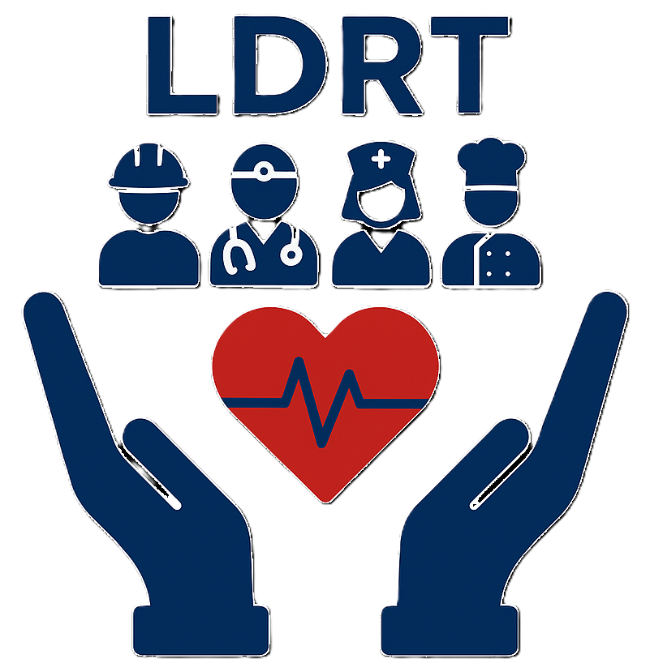
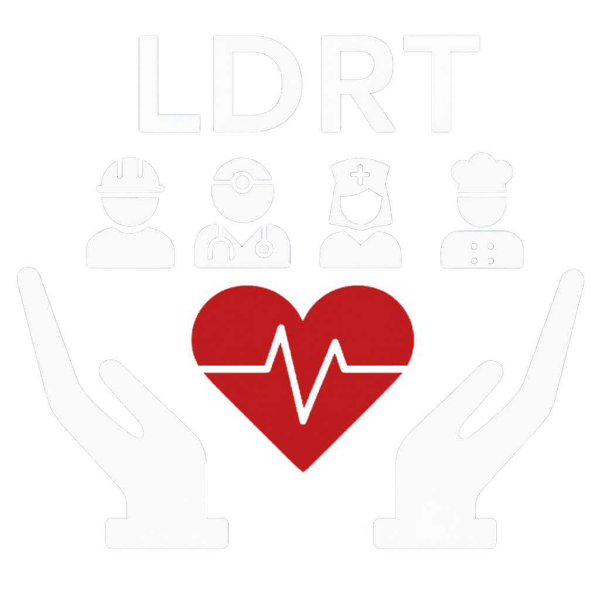

<p align="center">
  
  &nbsp;&nbsp;&nbsp;
  
</p>

# LDRT Web — Lista de Doenças Relacionadas ao Trabalho 🩺

[](https://hiagowms.github.io/ldrt/)
[](https://play.google.com/store/apps/details?id=com.ldrtcrst.app&hl=pt_BR)


**LDRT Web é a versão web/PWA gratuita, sem anúncios e offline-first do buscador da Lista de Doenças Relacionadas ao Trabalho (LDRT), baseada na PORTARIA GM/MS Nº 1.999, de 27 de novembro de 2023.** Abre no navegador, instala como app (PWA) e funciona sem internet após o primeiro acesso. Mesma lógica do app Android: escolha o modo de busca (Doença ou Agente/Fator de Risco), digite o termo ou CID-10 e navegue por uma rede bidirecional que liga cada doença aos seus fatores de risco — e cada fator às doenças que ele provoca.

Desenvolvido por **Hiago Wállacy Marques Silva (Médico — CEREST Botucatu)**, com revisão e divulgação da equipe do **CEREST Botucatu**.

🌐 **Acesse agora:** [hiagowms.github.io/ldrt](https://hiagowms.github.io/ldrt/)
📲 **Versão Android nativa:** [Play Store — com.ldrtcrst.app](https://play.google.com/store/apps/details?id=com.ldrtcrst.app&hl=pt_BR) · [Código-fonte](https://github.com/hiagowms/ldrt-android)

> [!WARNING]
> **Este aplicativo não é oficial** e não substitui a consulta direta à portaria oficial do Ministério da Saúde. Use como ferramenta de apoio à prática clínica e ao ensino, não como fonte normativa única.

> [!TIP]
> Nada é enviado para servidor. Tudo roda no navegador — **nenhum dado sai do seu dispositivo**. Funciona sem internet após o primeiro carregamento (Service Worker).

## Principais Recursos ⭐

- 🚀 **Zero login, zero cadastro**: Abre o link e usa. Sem conta, sem permissões.

- 📥 **Instalável como PWA**: No celular ou desktop, instale como aplicativo nativo direto do navegador (`manifest.json` + Service Worker). Ícone na tela inicial, tela cheia, sem barra de URL.

- 🔄 **Redirecionamento inteligente**: Acesso pelo celular cai direto na versão PWA (`pwa/index.html`); desktop vê página de apresentação com preview do app.

- 🔒 **Offline-first e LGPD-compliant**: Service Worker (`pwa/sw.js`) faz cache de todos os assets e dados (`LDRT_DATA` em `pwa/js/data.js`). Sem backend, sem analytics, sem trackers, sem chamadas de rede. Nenhuma busca é registrada.

- 🔍 **Busca bidirecional**: Procure por **Doença** (nome ou CID-10 com/sem ponto) para listar agentes e fatores de risco associados. Procure por **Agente/Fator de Risco** para listar doenças associadas.

- ♾️ **Navegação infinita**: Toque numa doença → vê fatores. Toque num fator → vê outras doenças. Continue montando o mapa de relações sem voltar ao topo.

- 🏷️ **Filtro por categoria**: No modo Fator de Risco, filtre por **Físico**, **Químico**, **Biológico** ou **Outro**.

- 🔤 **Busca tolerante a acentos e caixa**: Normalização interna remove diacríticos e ignora maiúsculas/minúsculas — `pneumoconiose` acha `Pneumoconioses`, `h833` acha `H83.3`.

- 📖 **Texto expandido para fatores psicossociais**: Categorias como *gestão organizacional*, *contexto da organização do trabalho*, *jornada de trabalho* etc. trazem definição completa expandível inline.

- 📋 **Cópia rápida**: Toque-e-segure (ou clique) em qualquer item para copiar individualmente. Botão de cópia no header copia título + lista inteira (incluindo textos expandidos) de uma vez.

- 🎨 **Modo visual por contexto**: Azul escuro (`#1A237E`) para Doença, ciano escuro (`#006064`) para Fator de Risco — pista visual constante sobre o modo ativo. Mesma paleta do app Android.

- 📱 **Responsivo e Material Design**: Layout adapta de celular a desktop. Preferências (modo, categoria) persistidas em `localStorage`.

- 🆓 **Gratuito e sem anúncios**: Utilidade pública para a saúde do trabalhador.

## Como Usar 🚀

### Acessar online 🌐

**👉 [hiagowms.github.io/ldrt](https://hiagowms.github.io/ldrt/)**

- **No celular**: o link redireciona automaticamente para o PWA. Use o menu do navegador → *Instalar app* / *Adicionar à tela inicial* para virar ícone nativo.
- **No desktop**: página de apresentação. Para instalar como app de janela, use o botão de instalação do navegador (Chrome/Edge).

### Rodar localmente (desenvolvimento) 💻

Projeto é HTML/CSS/JS puro — sem build, sem dependências. Basta um servidor estático (Service Worker exige HTTP, não funciona via `file://`):

```bash
git clone https://github.com/hiagowms/ldrt.git
cd ldrt

# Opção 1: Python
python -m http.server 8000

# Opção 2: Node (npx)
npx serve .

# Opção 3: PHP
php -S localhost:8000
```

Depois abra `http://localhost:8000/`. Para testar o PWA direto: `http://localhost:8000/pwa/`.

### Fluxo de uso

1. Abra o site/PWA — splash screen → tela de busca.
2. Escolha o **modo de busca** (botão central): `Doença` ou `Fator de Risco`.
3. Digite o termo (nome, CID com ou sem ponto, ou agente). Resultados filtram em tempo real.
4. Toque num item → tela de detalhes com a rede de relações.
5. Toque em qualquer item da rede para continuar navegando. **Segure** para copiar. Use o botão 📋 do header para copiar tudo.
6. Para fatores psicossociais, expanda (▼) a descrição oficial completa.

## Arquitetura Técnica ⚙️

```
┌──────────────────────────────────────────────────────────┐
│  OFFLINE-FIRST   ████████████  Service Worker + cache    │
│  ZERO BACKEND    ████████████  Sem servidor, sem rede    │
│  ZERO TRACKING   ████████████  Sem GA, sem telemetria    │
│  ZERO ADS        ████████████  Sem SDK de publicidade    │
│  ZERO BUILD      ████████████  HTML/CSS/JS puro          │
└──────────────────────────────────────────────────────────┘
```

| Camada | Tecnologia | Função |
|---|---|---|
| Hospedagem | GitHub Pages (estático) | Servir HTML/CSS/JS |
| Landing | `index.html` (raiz) | Apresentação desktop + redirect mobile → PWA |
| App | `pwa/index.html` + Vanilla JS | Splash, busca, detalhes, expansões |
| Estilo | CSS puro (`pwa/css/style.css`) | Material Design responsivo |
| Dados | `pwa/js/data.js` (`window.LDRT_DATA`) | Fonte única embarcada: fator, CID, nome, categoria |
| Estado | `localStorage` + variáveis locais | Persiste modo de busca e categoria |
| Offline | `pwa/sw.js` (Service Worker) | Cache de assets e dados (`ldrt-pwa-v2`) |
| Instalação | `pwa/manifest.json` + `installPrompt.js` | PWA instalável (Android/Chrome/Edge) |
| Cópia | `navigator.clipboard` | Copia item, título ou bloco completo |

### Módulos principais

- **`index.html`** — landing page para desktop com preview do app e botão de instalação; em mobile redireciona para `pwa/index.html`.
- **`pwa/index.html`** — markup do app (splash, tela de busca, tela de detalhes, diálogo de informações).
- **`pwa/js/app.js`** — lógica completa: toggle Doença ↔ Fator de Risco, filtro de categoria, normalização sem acentos, navegação bidirecional, expansão de textos psicossociais, cópia individual e cópia total.
- **`pwa/js/data.js`** — `window.LDRT_DATA` com a base oficial (`fatorDeRisco`, `cidComPonto`, `cidSemPonto`, `nomeCondicao`, `categoria`).
- **`pwa/js/installPrompt.js`** — captura `beforeinstallprompt` e oferece instalação como PWA.
- **`pwa/sw.js`** — Service Worker: cacheia assets + fontes, serve offline, limpa caches antigos.
- **`pwa/manifest.json`** — metadados do PWA (nome, ícones 192/512, `display: standalone`, theme `#1A237E`).

## Estrutura do Projeto 📁

```
ldrt/
├── index.html                       Landing desktop + redirect mobile
├── pwa/
│   ├── index.html                   App PWA (splash + busca + detalhes)
│   ├── manifest.json                Metadados PWA (ícones, theme, display)
│   ├── sw.js                        Service Worker (cache offline)
│   ├── apple-touch-icon.png         Ícone iOS
│   ├── css/
│   │   └── style.css                Estilos Material Design responsivo
│   ├── js/
│   │   ├── app.js                   Lógica: busca, filtro, navegação, cópia
│   │   ├── data.js                  Base LDRT (window.LDRT_DATA)
│   │   └── installPrompt.js         Prompt de instalação PWA
│   └── assets/
│       ├── logo.png                 Ícone do app
│       └── logo2.png                Logo institucional
│
├── LICENSE                          MIT
└── README.md                        (este arquivo)
```

## Base Normativa 📜

Os dados de fatores de risco, CIDs e doenças são extraídos da **PORTARIA GM/MS Nº 1.999, de 27 de novembro de 2023**, que atualiza a Lista de Doenças Relacionadas ao Trabalho do Ministério da Saúde. O arquivo `pwa/js/data.js` (`window.LDRT_DATA`) é a fonte autoritativa do app.

## Privacidade & LGPD 🔒

O app lida com termos que podem refletir hipóteses diagnósticas. Por isso:

- ✅ **100% client-side** — buscas não saem do navegador.
- ✅ **Sem Google Analytics, Firebase, Crashlytics** ou trackers de terceiros.
- ✅ **Sem permissões sensíveis** (sem localização, contatos, câmera).
- ✅ **Sem SDK de publicidade**.
- ✅ **Dados estáticos embarcados** — nenhum download dinâmico após o primeiro carregamento.
- ✅ **`localStorage`** usado apenas para preferências locais (modo de busca, categoria).

Em conformidade com a **Lei Geral de Proteção de Dados (LGPD — Lei 13.709/2018)**.

## Contexto Institucional 🤝

Aplicativo desenvolvido por **Hiago Wállacy Marques Silva** (Médico — CEREST Botucatu), com revisão e divulgação pela equipe do **CEREST Botucatu** (Centro de Referência em Saúde do Trabalhador). Ferramenta de utilidade pública para apoiar o ensino e a prática em saúde do trabalhador.

## Avisos Legais ⚠️

- Este aplicativo **não é oficial**.
- **Não substitui** a consulta direta à portaria oficial do Ministério da Saúde.
- Destina-se a apoio à prática clínica, ensino e pesquisa, **não a fins normativos**.

## Licença 📄

[MIT](./LICENSE) — uso, modificação e distribuição livres, com atribuição.

## Suporte 💬

Dúvidas, sugestões ou problemas? Entre em contato com o CEREST Botucatu ou abra uma issue no repositório.

Feito por [Hiago](https://github.com/hiagowms) — CEREST Botucatu
